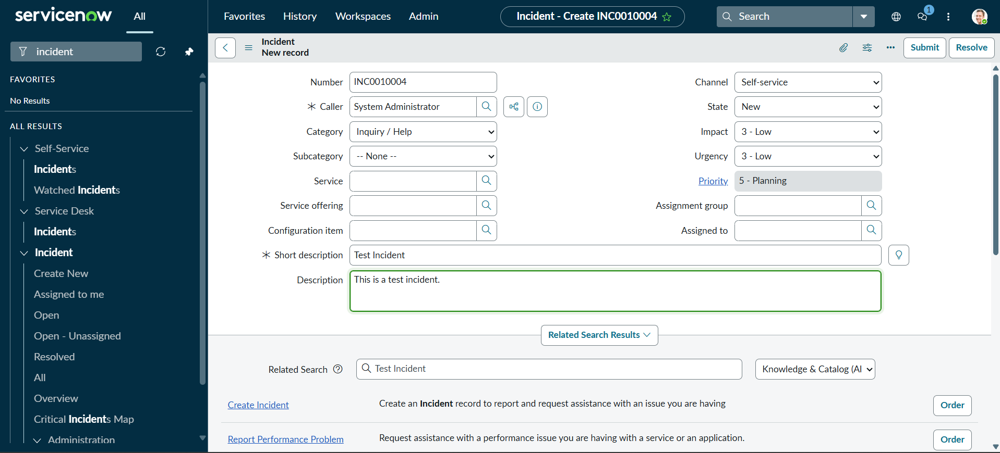
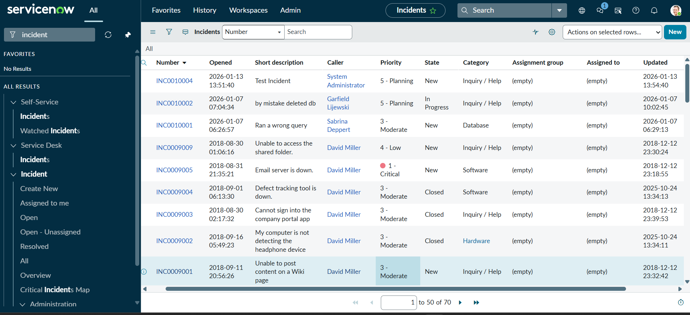
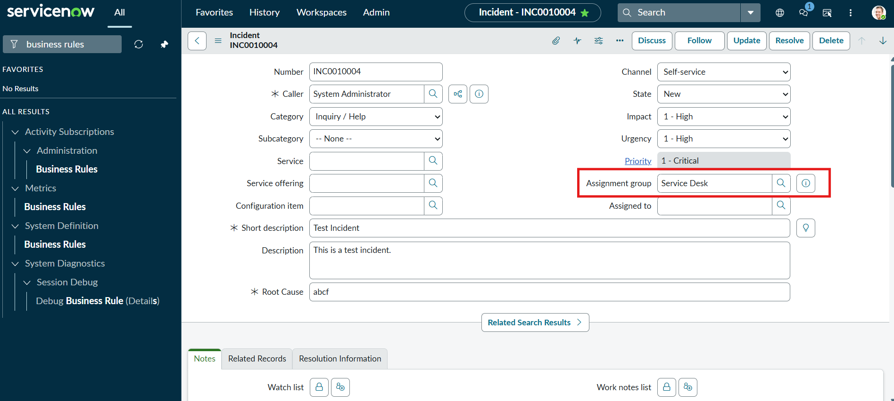

# servicenow_incident_management

# ServiceNow Automated Incident Management Project:

# Overview:
Implemented an automated Incident Management solution using ServiceNow ITSM best practices.

# Features
1. Created custom incident fields and form configuration.
2. Created UI Policies to impose mandatory Root Cause field for high-impact incidents.
3. Created Client Scripts (an Alert for user to input root cause) to guide users during incident creation.
4. Created Business Rules to auto-assign incidents based on priority.
5. Performed End-to-end testing of incident lifecycle.

# Technologies Used
1. ServiceNow
2. JavaScript
3. Methodologies: ITSM / ITIL

# Key Learnings
1. Understood Difference between client-side and server-side execution. (In client-side, changes are updated immediately and in server-side changes are committed after insert/update/save is performed.)
2. Proper use of UI Policies vs Client Scripts.
3. Debugging Business Rule execution timing. (Faced issues while writing Business Rules at first but later debugged the error.)
4. Understood how enterprise systems help users to avoid mistakes.

# ServiceNow PDI Screenshots:

1. Original Incident Form:

2. Creation of new Incident record:

3. Custom Field - Root Cause:

4. UI Policy Enforcement:

5. Client Script Alert

6. Business Rule Auto Assignment

